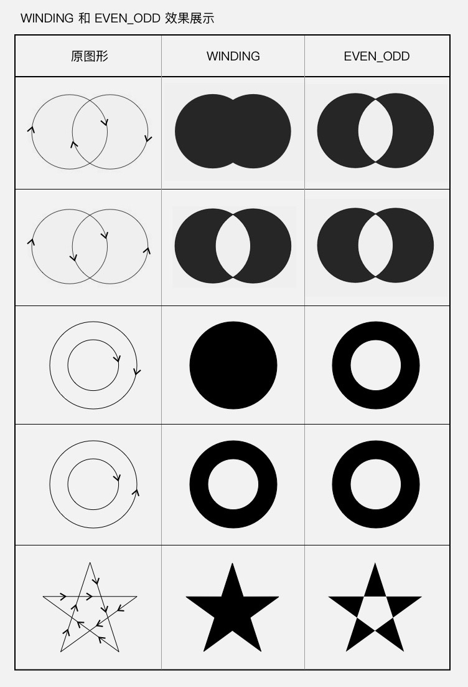
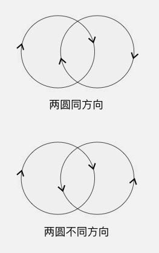
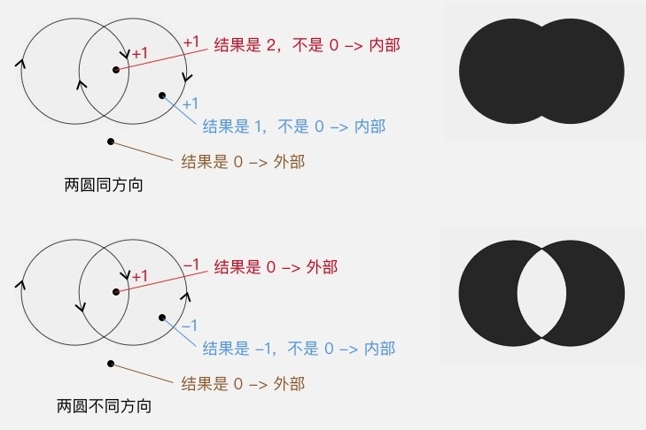
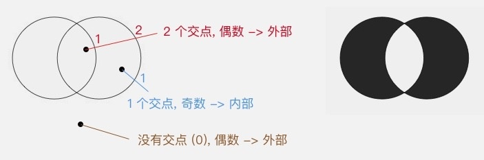

https://rengwuxian.com/ui-1-1/

## Path.setFillType(Path.FillType ft) 设置填充方式
方法中填入不同的 FillType 值，就会有不同的填充效果。FillType 的取值有四个：
EVEN_ODD
WINDING（默认值）
INVERSE_EVEN_ODD
INVERSE_WINDING

其中后面的两个带有 INVERSE_ 前缀的，只是前两个的反色版本，所以只要把前两个，即 EVEN_ODD 和
WINDING，搞明白就可以了。

## WINDING
即 non-zero winding rule （非零环绕数原则）：首先，它需要你图形中的所有线条都是有绘制方向的：

然后，同样是从平面中的点向任意方向射出一条射线，但计算规则不一样：以 0 为初始值，对于射线和图形
的所有交点，遇到每个顺时针的交点（图形从射线的左边向右穿过）把结果加 1，遇到每个逆时针的交点（图
形从射线的右边向左穿过）把结果减 1，最终把所有的交点都算上，得到的结果如果不是 0，则认为这个点在
图形内部，是要被涂色的区域；如果是 0，则认为这个点在图形外部，是不被涂色的区域。

## EVEN_ODD
即 even-odd rule （奇偶原则）：对于平面中的任意一点，向任意方向射出一条射线，这条射线和图形
相交的次数（相交才算，相切不算哦）如果是奇数，则这个点被认为在图形内部，是要被涂色的区域；如
果是偶数，则这个点被认为在图形外部，是不被涂色的区域。还以左右相交的双圆为例：

