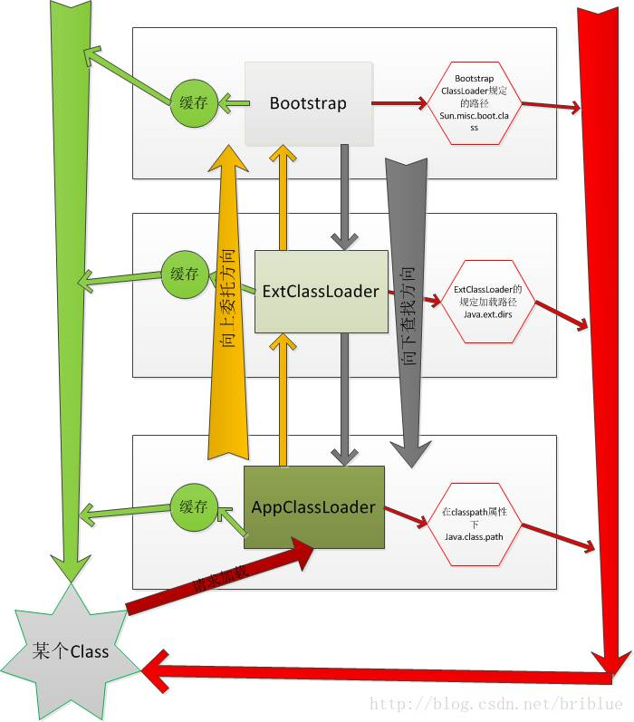

# 超详细java中的ClassLoader详解 https://blog.csdn.net/briblue/article/details/54973413

ClassLoader 翻译过来就是 类加载器，普通的Java开发者其实用到的不多，但对于某些框架开发者来说却非常常见。
理解 ClassLoader 的加载机制，也有利于我们编写出更高效的代码。
ClassLoader 的具体作用就是将 class文件 加载到 jvm虚拟机 中去，程序就可以正确运行了。但是，jvm 启动的时候，
并不会一次性加载所有的class文件，而是根据需要去动态加载。
HelloWorld.java --编译--> HelloWorld.class 字节码文件

# Java语言系统的四种类加载器:
Bootstrap ClassLoader 最顶层的加载类，主要加载核心类库，%JRE_HOME%\lib 下的 rt.jar、resources.jar、charsets.jar 和 
class等。
Extention ClassLoader 扩展的类加载器，加载目录 %JRE_HOME%\lib\ext 目录下的jar包和class文件。
Appclass Loader 也称为 SystemAppClass 加载当前应用的classpath的所有类。
自定义类加载器（User ClassLoader）。

Android类加载器
类似的，在Android中也可以分为系统类加载器和自定义类加载器两种。而系统类加载器同样有三种，分别是：
BootClassLoader；系统启动时用于加载系统常用类，ClassLoader内部类；
PathClassLoader；加载系统类和应用程序类，一般不建议开发者使用；
DexClassLoader；加载dex文件及其包含dex文件的apk或者jar。也支持从SD卡进行加载，也就是说可以在应用为
安装的情况下加载dex相关文件。

在说Android的类加载机制之前先说一下Java的类加载机制，两者都是的大同小异，只是Android中的加载的是dex文件，
Java中加载的是.class文件。

# 每个类加载器都有一个父加载器
每个类加载器都有一个父加载器，比如加载 Test.class 是由 AppClassLoader 完成，那么 AppClassLoader 也有一个父加载器，
怎么样获取呢？很简单，通过 getParent 方法。
AppClassLoader 的父加载器是 ExtClassLoader。那么 ExtClassLoader 的父加载器又是谁呢？
Bootstrap ClassLoader 是由C/C++编写的，它本身是虚拟机的一部分，所以它并不是一个JAVA类，也就是无法在java代码中获取它的引用，
JVM 启动时通过 Bootstrap类 加载器加载 rt.jar 等核心jar包中的 class文件，之前的 int.class,String.class 都是由它加载。

# 双亲委托
一个类加载器查找 class 和 resource 时，是通过“委托模式”进行的，它首先判断这个class是不是已经加载成功，如果没有的话它
并不是自己进行查找，而是先通过父加载器，然后递归下去，直到 Bootstrap ClassLoader，如果 Bootstrap classloader 找到了，直
接返回，如果没有找到，则一级一级返回，最后到达自身去查找这些对象。这种机制就叫做双亲委托。

用序列描述一下：
1. 一个 AppClassLoader 查找资源时，先看看缓存是否有，缓存有从缓存中获取，否则委托给父加载器。
2. 递归，重复第1部的操作。
3. 如果 ExtClassLoader 也没有加载过，则由 Bootstrap ClassLoader 出面，它首先查找缓存，如果没有找到的话，
就去找自己的规定的路径下，也就是 sun.mic.boot.class 下面的路径。找到就返回，没有找到，让子加载器自己去找。
4. Bootstrap ClassLoader 如果没有查找成功，则 ExtClassLoader 自己在 java.ext.dirs 路径中去查找，查找成功就返回，
查找不成功，再向下让子加载器找。
5. ExtClassLoader 查找不成功，AppClassLoader 就自己查找，在 java.class.path 路径下查找。找到就返回。如果没有找
到就让子类找，如果没有子类会怎么样？抛出各种异常。
上面的序列，详细说明了双亲委托的加载流程。我们可以发现委托是从下向上，然后具体查找过程却是自上至下。

# 自定义ClassLoader
不知道大家有没有发现，不管是 Bootstrap ClassLoader 还是 ExtClassLoader等，这些类加载器都只是加载指定的目录下的jar包或者资源。
如果在某种情况下，我们需要动态加载一些东西呢？比如从D盘某个文件夹加载一个class文件，或者从网络上下载class主内容然后再进行加载，
这样可以吗？
如果要这样做的话，需要我们自定义一个 classloader。

自定义步骤：
1. 编写一个类继承自 ClassLoader 抽象类。
2. 复写它的 findClass() 方法。
3. 在 findClass() 方法中调用 defineClass()

defineClass()这个方法在编写自定义 classloader 的时候非常重要，它能将 class 二进制内容转换成 Class对象，
如果不符合要求的会抛出各种异常。

一个 ClassLoader 创建时如果没有指定 parent，那么它的 parent 默认就是 AppClassLoader。

# 自定义ClassLoader的使用场景
实现自己某些特殊的需求，我们就得自定义ClassLoader，自已指定加载的路径，可以是磁盘、内存、网络或者其它。
在某些情况下，我们需要自定义类加载器来加载一些特殊的类，例如：
想要加载一些加密或者压缩过的类文件；
想要在运行时动态的加载某些类；
想要实现一个热部署功能等。

# 重点看下，热更新的原理

