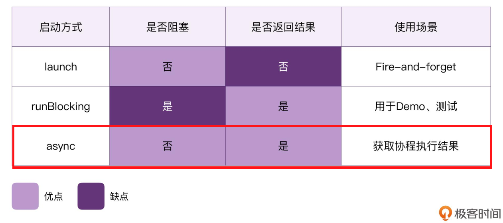

#1.协程
协程是 Kotlin 对比 Java 的最大优势。
而 Kotlin 的协程，可以帮我们极大地简化异步、并发编程、优化软件架构。
通过协程，我们不仅可以提高开发效率，还能提高代码的可读性，由此也就可以降低代码出错的概率。

如果要用简单的语言来描述协程的话，我们可以将其称为：“互相协作的程序”。
互相协作的程序
Cooperative-routine -》 Coroutine

协程，可以理解为更加轻量的线程，成千上万个协程可以同时运行在一个线程当中；
协程，其实是运行在线程当中的轻量的 Task；
协程，不会与特定的线程绑定，它可以在不同的线程之间灵活切换

协程的“非阻塞”
另外，协程对比线程还有一个特点，那就是非阻塞（Non Blocking），而线程则往往是阻塞式的。

Kotlin 协程的“非阻塞”其实只是语言层面的，当我们调用 JVM 层面的 Thread.sleep() 的时候，
它仍然会变成阻塞式的。与此同时，这也意味着我们在协程当中应该尽量避免出现阻塞式的行为。尽量使用 delay，
而不是 sleep。

那么，我们该如何理解 Kotlin 协程的“非阻塞”？答案是：挂起和恢复。这两个能力也是协程才拥有的特殊能
力，普通的程序是不具备的。

广义的协程，可以理解为“互相协作的程序”，也就是“Cooperative-routine”。
协程框架，是独立于 Kotlin 标准库的一套框架，它封装了 Java 的线程，对开发者暴露了协程的 API。
程序当中运行的“协程”，可以理解为轻量的线程；
一个线程当中，可以运行成千上万个协程；
协程，也可以理解为运行在线程当中的非阻塞的Task；
协程，通过挂起和恢复的能力，实现了“非阻塞”；
协程不会与特定的线程绑定，它可以在不同的线程之间灵活切换，而这其实也是通过“挂起和恢复”来实现的。

# Kotlin既然支持协程了，那么还需要使用线程吗？

#2.设置 VM 参数、断点调试
将 VM 参数设置成“-Dkotlinx.coroutines.debug”。

断点调试协程
除了设置 VM 参数之外，我们还可以直接使用 IDE 的调试功能，直接以打断点的形式来调试协程。

#3.三种启动协程的方式，分别是 launch、runBlocking、async。
launch，是典型的“Fire-and-forget”场景，它不会阻塞当前程序的执行流程，使用这种方式的时候，我们无
法直接获取协程的执行结果。它有点像是生活中的射箭。
打个比方，launch 一个协程任务，就像猎人射箭一样。
箭一旦射出去了，目标就无法再被改变；协程一旦被 launch，那么它当中执行的任务也不会被中途改变。
箭如果命中了猎物，猎物也不会自动送到我们手上来；launch 的协程任务一旦完成了，即使有了结果，也没办
法直接返回给调用方。

runBlocking，我们可以获取协程的执行结果，但这种方式会阻塞代码的执行流程，因为它一般用于测试用途，
生产环境当中是不推荐使用的。

async，则是很多编程语言当中普遍存在的协程模式。它像是结合了 launch 和 runBlocking 两者的优点。它
既不会阻塞当前的执行流程，还可以直接获取协程的执行结果。它有点像是生活中的钓鱼。

源码分析：CoroutineScope.launch()，代表了 launch 其实是一个扩展函数。好好看下。
CoroutineScope.async() //扩展函数
runBlocking() //顶层函数

#4. 挂起函数
Kotlin 协程最大的优势，就在于它的挂起函数。
回调地狱。
我们给它取这个名字是有原因的，以上代码存在诸多缺陷：可读性差、扩展性差、维护性差，极易出错！

Kotlin 协程的魅力：以同步的方式完成异步任务。

所谓的挂起函数，其实就是比普通的函数多了一个 suspend 关键字而已。如果去掉这个 suspend 关键字，所有的
函数都会变成普通函数。

挂起函数最神奇的地方，就在于它的挂起和恢复功能。从字面上看，suspend 这个词就是“挂起”的
意思，而它既然能被挂起，自然就还可以被恢复。它们两个一般是成对出现的。

挂起函数可以极大地简化异步编程，让我们能够以同步的方式写异步代码。相比“回调地狱”式的代码，挂起函
数写出来的代码可读性更好、扩展性更好、维护性更好，也更难出错。而除此之外，你也需要牢记以下这些核心
要点，来更好地掌握挂起函数。

要定义挂起函数，我们只需在普通函数的基础上，增加一个 suspend 关键字。
suspend 这个关键字，是会改变函数类型的，“suspend (Int) -> Double”与“(Int) -> Double”并不是同一个类型。

挂起函数，由于它拥有挂起和恢复的能力，因此对于同一行代码来说，“=”左右两边的代码分别可以执行在不
同的线程之上。而这一切，都是因为 Kotlin 编译器这个幕后的翻译官在起作用。

挂起函数的本质，就是 Callback。只是说，Kotlin 底层用了一个更加高大上的名字，叫 Continuation。而 Kotlin
编译器将 suspend 翻译成 Continuation 的过程，则是 CPS 转换。
这里的 Continuation 是代表了，“程序继续运行下去需要执行的代码”，“接下来要执行的代码”，或者是 “剩下的代码”。

Continuation 本质上也就是一个带有泛型参数的 CallBack，只是它的名字看起来有点吓人而已。这个“从挂起函数
转换成 CallBack 函数”的过程，被叫做是 CPS 转换 （Continuation-Passing-Style Transformation）。

最后，我们还探索了协程与挂起函数之间的关系。我们发现：挂起函数，只能在协程当中被调用，或者是被其他
挂起函数调用。但协程中的 block，本质上仍然是挂起函数。

所以，我们可以认为：挂起和恢复是协程的一种底层能力；而挂起函数则是一种上层的表现形式。

协程之所以是非阻塞，是因为它支持“挂起和恢复”；而挂起和恢复的能力，主要是源自于“挂起函数”；而挂起
函数是由 CPS 实现的，其中的 Continuation，本质上就是 Callback。

# 5.

