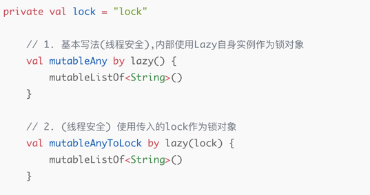
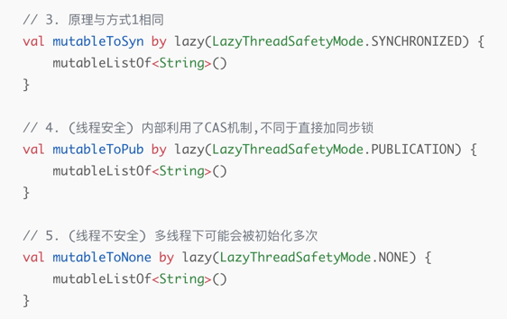
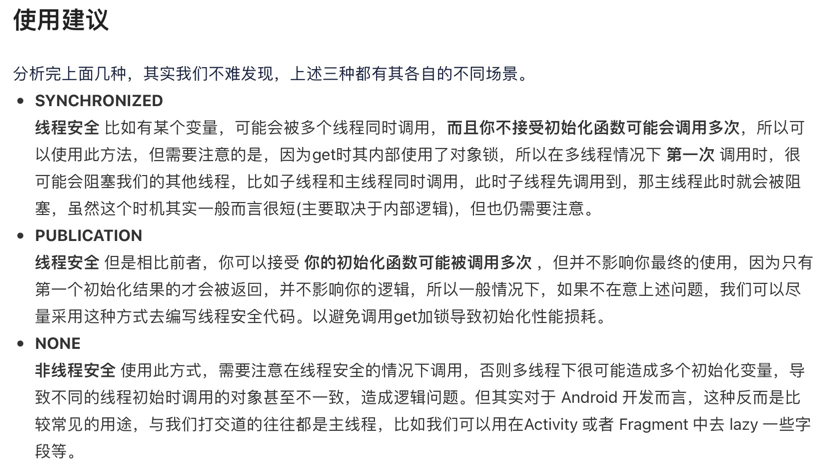

作者：朱涛的自习室
链接：https://juejin.cn/post/6844904191098355719
来源：稀土掘金
著作权归作者所有。商业转载请联系作者获得授权，非商业转载请注明出处。
----------------------------
基础语法
数据类型
可见性修饰符
var与val
空安全
类型转换 is as as?
if for when
结构相等 ==    引用相等 ===
函数
类 构造函数 继承
This inner 内部类
@数据类data class 序列化
@扩展函数 扩展属性
@委托 by by lazy 懒加载 懒加载线程模式
##-----------------------------------------------

快速认识 Kotlin
Kotlin 是著名 IDE 公司 JetBrains 创造出的一门基于 JVM 的语言。Kotlin 有着以下几个特点：

简洁，1行顶5行
安全，主要指“空安全”
兼容，与 Java 兼容
工具友好，IntelliJ 对 Kotlin 简直不要太友好

JetBrains 不仅创造了 Kotlin，还创造了著名的 IntelliJ IDEA。Android 开发者使用的 Android Studio 就是基于 IntelliJ 改造出来的。

基础语法
1. 所有 Kotlin 类都是对象 (Everything in Kotlin is an object)
   与 Java 不一样是：Kotlin 没有基本数据类型 (Primitive Types)，所有 Kotlin 里面的类都是对象，它们都继承自: Any这个类；
   与 Java 类似的是，Kotlin 提供了如下的内置类型：
Type  Bit width   备注
Double  64  Kotlin 没有 double
Float   32  Kotlin 没有 float
Long    64  Kotlin 没有 long
Int     32  Kotlin 没有 int/Integer
Short   16  Kotlin 没有 short
Byte    8   Kotlin 没有 byte
思考题1：
既然 Kotlin 与 Java 是兼容的，那么 Kotlin Int 与 Java int、Java Integer 之间是什么关系？

Kotlin: Int

class Int : Number, Comparable<Int>
(Common source) (Native source)

For Common, JVM, JS
Represents a 32-bit signed integer. On the JVM, non-nullable values of this type are represented as 
values of the primitive type int.

表示32位有符号整数。在JVM上，这种类型的非空值表示为
基本类型int的值。
A Int是原始类型.这相当于JVM int.
可以为空的Int Int?是盒装类型.这相当于java.lang.Integer.

For Native
Represents a 32-bit signed integer.

思考题2：
Kotlin Any 类型与 Java Object 类型之间有什么关系？

2.可见性修饰符 (Visibility Modifiers)
修饰符描述
public与Java一致
private与Java一致
protected与Java一致
internal同 Module 内可见

3. 变量定义 (Defining Variables)
   定义一个 Int 类型的变量:
   var a: Int = 1
   
   定义一个 Int 类型的常量(不可变的变量？只读的变量？)
   val b: Int = 1
   
   类型可推导时，类型申明可省略:
   val c = 1
   
   语句末尾的;可有可无:
   val d: Int;
   d = 1;
   
   小结：

var 定义变量
val 定义常量(不可变的变量？只读变量？)
Kotlin 支持类型自动推导

思考题3：
Kotlin val 变量与 Java 的 final 有什么关系？
val 和 final 用于修饰变量的时候，都是用于常量声明。
val与final差别之处目前发现仅在于如下特殊写法。

4 空安全 (Null Safety)

定义一个可为空的 String 变量:
var b: String? = "Kotlin"
b = null
print(b)
// 输出 null

定义一个不可为空的 String 变量:
var a: String = "Kotlin"
a = null
// 编译器报错，null 不能被赋给不为空的变量

变量赋值：
var a: String? = "Kotlin"
var b: String = "Kotlin"
b = a // 编译报错，String? 类型不可以赋值给 String 类型

a = b // 编译通过

空安全调用
var a: String? = "Kotlin"
print(a.length) // 编译器报错，因为 a 是可为空的类型
a = null
print(a?.length) // 使用?. 的方式调用，输出 null

Elvis 操作符 艾维斯
// 下面两个语句等价
val l: Int = if (b != null) b.length else -1
val l = b?.length ?: -1

// Elvis 操作符在嵌套属性访问时很有用
val name = userInstance?.user?.baseInfo?.profile?.name?: "Kotlin"

小结：

T 代表不可为空类型，编译器会检查，保证不会被 null 赋值
T? 代表可能为空类型
不能将 T? 赋值给 T
使用 instance?.fun() 进行空安全调用
使用 Elvis 操作符为可空变量替代值，简化逻辑

5. 类型检查与转换 (Type Checks and Casts)
   类型判断、智能类型转换：
   if (x is String) {
   print(x.length) // x 被编译自动转换为 String
   }
   // x is String 类似 Java 里的 instanceOf
   
   不安全的类型转换 as
   val y = null
   val x: String = y as String
   //抛异常，null 不能被转换成 String
   
   安全的类型转换 as?
   val y = null
   val z: String? = y as? String
   print(z)
   // 输出 null
   
   小结：

使用 is 关键字进行类型判断
使用 as 进行类型转换，可能会抛异常
使用 as? 进行安全的类型转换

6. if 判断
   基础用法跟 Java 一毛一样。它们主要区别在于：Java If is Statement，Kotlin If is Expression。
   因此它对比 Java 多了些“高级”用法，懒得讲了，咱看后面的实战吧。

7. for 循环
   跟 Java 也差不多，随便看代码吧：
   // 集合遍历，跟 Java 差不多
   for (item in collection) {
   print(item)
   }

// 辣鸡 Kotlin 语法
for (item in collection) print(item)

// 循环 1，2，3
for (i in 1..3) {
println(i)
}

// 6，4，2，0
for (i in 6 downTo 0 step 2) {
println(i)
}

8. when
   when 就相当于高级版的 switch，它的高级之处在于支持模式匹配(Pattern Matching):
   val x = 9
   when (x) {
   in 1..10 -> print("x is in the range")
   in validNumbers -> print("x is valid")
   !in 10..20 -> print("x is outside the range")
   is String -> print("x is String")
   x.isOdd() -> print("x is odd")
   else -> print("none of the above")
   }
   // 输出：x is in the range
   
9. 相等性 (Equality)
   Kotlin 有两种类型的相等性：

结构相等 (Structural Equality)
引用相等 (Referential Equality)

结构相等：
// 下面两句两个语句等价
a == b
a?.equals(b) ?: (b === null)
// 如果 a 不等于 null，则通过 equals 判断 a、b 的结构是否相等
// 如果 a 等于 null，则判断 b 是不是也等于 null

引用相等：
print(a === b)
// 判断 a、b 是不是同一个对象

思考题4：
val a: Int = 10000
val boxedA: Int? = a
val anotherBoxedA: Int? = a
print(boxedA == anotherBoxedA)
print(boxedA === anotherBoxedA)
// 输出什么内容?

思考题5：
val a: Int = 1
val boxedA: Int? = a
val anotherBoxedA: Int? = a
print(boxedA == anotherBoxedA)
print(boxedA === anotherBoxedA)
// 输出什么内容?

10. 函数 (Functions)
    fun triple(x: Int): Int {
    return 3 * x
    }
    // 函数名：triple
    // 传入参数：不为空的 Int 类型变量
    // 返回值：不为空的 Int 类型变量
    
11. 类 (Classes)
    类定义
    使用主构造器(Primary Constructor)定义类一个 Person 类，需要一个 String 类型的变量：
    class Person constructor(firstName: String) { ... }
    
    如果主构造函数没有注解或者可见性修饰符，constructor 关键字可省略:
    class Person(firstName: String) { ... }
    
    也可以使用次构造函数(Secondary Constructor)定义类：
    class Person {
    constructor(name: String) { ... }
    }

// 创建 person 对象
val instance = Person("Kotlin")

init 代码块
Kotlin 为我们提供了 init 代码块，用于放置初始化代码：
class Person {
var name = "Kotlin"
init {
name = "I am Kotlin."
println(name)
}

    constructor(s: String) {
        println(“Constructor”)
    }
}

fun main(args: Array<String>) {
Person("Kotlin")
}

以上代码输出结果为：
I am Kotlin.
Constructor

结论：init 代码块执行时机在类构造之后，但又在“次构造器”执行之前。

12. 继承 (Inheritance)

使用 open 关键字修饰的类，可以被继承
使用 open 关键字修饰的方法，可以被重写
没有 open 关键字修饰的类，不可被继承
没有 open 关键字修饰的方法，不可被重写
以 Java 的思想来理解，Kotlin 的类和方法，默认情况下是 final 的

定义一个可被继承的 Base 类，其中的 add() 方法可以被重写，test() 方法不可被重写：
open class Base {
open fun add() { ... }
fun test() { ... }
}

定义 Foo 继承 Base 类，重写 add() 方法
class Foo() : Base() {
override fun add() { ... }
}

使用 : 符号来表示继承
使用 override 重写方法

13. This 表达式 (Expression)
    class A {

    fun testA(){	}

    inner class B { // 在 class A 定义内部类 B

        fun testB(){	}

        fun foo() {
            this.testB() // ok
            this.testA() // 编译错误
            this@A.testA() // ok
            this@B.testB() // ok
        }
    }
    }
    
    小结：

inner 关键字定义内部类
在内部类当中访问外部类，需要显示使用 this@OutterClass.fun() 的语法

14. 数据类 (Data Class)
    假设我们有个这样一个 Java Bean:
    public class Developer {
    private String name;

        public Developer(String name) {
            this.name = name;
        }

        public String getName() {
            return name;
        }

        public void setName(String name) {
            this.name = name;
        }

        @Override
        public boolean equals(Object o) {
            if (this == o) return true;
            if (o == null || getClass() != o.getClass()) return false;
            Developer developer = (Developer) o;
            return name != null ? name.equals(developer.name) : developer.name == null;
        }

        @Override
        public int hashCode() {
            int result = name != null ? name.hashCode() : 0;
            return result;
        }

        @Override
        public String toString() {
            return "Developer{" + "name='" + name + '}';
        }
    }
    
    如果我们将其翻译成 Kotlin 代码，大约会是这样的:
    class Developer(var name: String?) {

    override fun equals(o: Any?): Boolean {
    if (this === o) return true
    if (o == null || javaClass != o.javaClass) return false
    val developer = o as Developer?
    return if (name != null) name == developer!!.name else developer!!.name == null
    }

    override fun hashCode(): Int {
    return if (name != null) name!!.hashCode() else 0
    }

    override fun toString(): String {
    return "Developer{" + "name='" + name + '}'.toString()
    }
    }
    
    然而，Kotlin 为我们提供了另外一种选择，它叫做数据类:
    data class Developer(var name: String)
    
    上面这一行简单的代码，完全能替代前面我们的写的那一大堆模板 Java 代码，甚至额外多出了一些功能。如果将上面的数据类翻译成等价的 Java 代码，大概会长这个样子：
    public final class Developer {
    @NotNull
    private String name;

public Developer(@NotNull String name) {
super();
this.name = name;
}

@NotNull
public final String getName() {   return this.name;   }

public final void setName(@NotNull String var1) {    this.name = var1;   }

@NotNull
public final Developer copy(@NotNull String name) {   return new Developer(name);   }

public String toString() {   return "Developer(name=" + this.name + ")";   }

public int hashCode() {   return this.name != null ? this.name.hashCode() : 0;   }

public boolean equals(Object var1) {
if (this != var1) {
if (var1 instanceof Developer) {
Developer var2 = (Developer)var1;
if (Intrinsics.areEqual(this.name, var2.name)) {
return true;
}
}
return false;
} else {
return true;
}
}
}

可以看到，Kotlin 的数据类不仅为我们提供了 getter、setter、equals、hashCode、toString，还额外的帮我们实现了 copy 方法！这也体现了 Kotlin 的简洁特性。
序列化的坑
如果是旧工程迁移到 Kotlin，那么可能需要注意这个坑:
// 定义一个数据类，其中成员变量 name 是不可为空的 String 类型，默认值是 MOMO
data class Person(val age: Int, val name: String = "Kotlin")
val person = gson.fromJson("""{"age":42}""", Person::class.java)
print(person.name) // 输出 null

对于上面的情况，由于 Gson 最初是为 Java 语言设计的序列化框架，并不支持 Kotlin 不可为空、默认值这些特性，从而导致原本不可为空的属性变成null，原本应该有默认值的变量没有默认值。
对于这种情，市面上已经有了解决方案:

kotlinx.serialization
moshi

15. 扩展 (Extensions)
//扩展方法为了不改变源码的情况下，给类增加一个方法、属性

如何才能在不修改源码的情况下给一个类新增一个方法？比如我想给 Context 类增加一个 toast 类，怎么做？

如果使用 Java，上面的需求是无法被满足的。然而 Kotlin 为我们提供了扩展语法，让我们可以轻松实现以上的需求。

扩展函数
为 Context 类定义一个 toast 方法：
fun Context.toast(msg: String, length: Int = Toast.LENGTH_SHORT){
Toast.makeText(this, msg, length).show()
}

扩展函数的使用：
val activity: Context? = getActivity()
activity?.toast("Hello world!")
activity?.toast("Hello world!", Toast.LENGTH_LONG)

属性扩展
除了扩展函数，Kotlin 还支持扩展属性，用法基本一致。

思考题6：
上面的例子中，我们给不可为空的 Context 类增加了扩展函数，因此我们在使用这个方法的时候需要判空。实际上，Kotlin 还支持我们为 可为空的 类增加扩展函数：
// 为 Context? 添加扩展函数
fun Context?.toast(msg: String, length: Int = Toast.LENGTH_SHORT){
if (this == null) {    //do something    }
Toast.makeText(this, msg, length).show()
}

扩展函数使用：
val activity: Context? = getActivity()
activity.toast("Hello world!")
activity.toast("Hello world!", Toast.LENGTH_LONG)

请问这两种定义扩展函数的方式，哪种更好？分别适用于什么情景？为什么？

16. 委托 (Delegation)
    Kotlin 中，使用by关键字表示委托：
    interface Animal {
       fun bark()
    }

// 定义 Cat 类，实现 Animal 接口
class Cat : Animal {
override fun bark() {
   println("喵喵")
}
}

// 将 Zoo 委托给它的参数 animal
class Zoo(animal: Animal) : Animal by animal

fun main(args: Array<String>) {
val cat = Cat()
Zoo(cat).bark()
}
// 输出结果：喵喵

属性委托 (Property Delegation)
其实，从上面类委托的例子中，我们就能知道，Kotlin 之所以提供委托这个语法，主要是为了方便我们使用者，让我们可以很方便的实现代理这样的模式。
这一点在 Kotlin 的委托属性这一特性上体现得更是淋漓尽致。

Kotlin 为我们提供的标准委托非常有用。
by lazy 实现”懒加载“
// 通过 by 关键字，将 lazyValue 属性委托给 lazy {} 里面的实现
val lazyValue: String by lazy {
val result = compute()
println("computed!")
result
}

// 模拟计算返回的变量
fun compute():String{
return "Hello"
}

fun main(args: Array<String>) {
println(lazyValue)
println("=======")
println(lazyValue)
}

以上代码输出的结果：
computed!
Hello
=======
Hello

由此可见，by lazy 这种委托的方式，可以让我们轻松实现懒加载。//懒加载
其内部实现，大致是这样的：

lazy 求值的线程模式: LazyThreadSafetyMode
Kotlin 为lazy 委托提供三种线程模式，他们分别是：

LazyThreadSafetyMode.SYNCHRONIZED
LazyThreadSafetyMode.NONE
LazyThreadSafetyMode.PUBLICATION

上面这三种模式，前面两种很好理解：

LazyThreadSafetyMode.SYNCHRONIZED 通过加锁实现多线程同步，这也是默认的模式。
LazyThreadSafetyMode.NONE 则没有任何线程安全代码，线程不安全。

我们详细看看LazyThreadSafetyMode.PUBLICATION，官方文档的解释是这样的：

Initializer function can be called several times on concurrent access to uninitialized [Lazy] instance value, but only the first returned value will be used as the value of [Lazy] instance.

意思就是，用LazyThreadSafetyMode.PUBLICATION模式的 lazy 委托变量，它的初始化方法是可能会被多个线程执行多次的，但最后这个变量的取值是仅以第一次算出的值为准的。即，哪个线程最先算出这个值，就以这个值为准。
by Delegates.observable 实现"观察者模式"的变量
观察者模式，又被称为订阅模式。最常见的场景就是：比如读者们订阅了MOMO公众号，每次MOMO更新的时候，读者们就会收到推送。而观察者模式应用到变量层面，就延伸成了：如果这个的值改变了，就通知我。
class User {
// 为 name 这个变量添加观察者，每次 name 改变的时候，都会执行括号内的代码
var name: String by Delegates.observable("<no name>") {
prop, old, new ->
println("name 改变了：$old -> $new")
}
}

fun main(args: Array<String>) {
val user = User()
user.name = "first: Tom"
user.name = "second: Jack"
}

以上代码的输出为：
name 改变了：<no name> -> first: Tom
name 改变了：first: Tom -> second: Jack

思考题7：
lazy 委托的LazyThreadSafetyMode.PUBLICATION适用于什么样的场景？

https://blog.51cto.com/petterp/5245141

