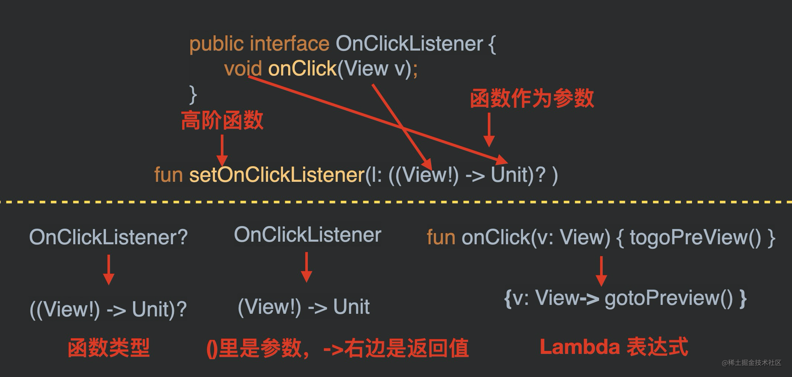

https://juejin.cn/post/6854573222457769991

Kotlin Jetpack 实战 | 04. Kotlin 高阶函数

函数类型
高阶函数
Lambda
带接收者的函数类型 apply
Kotlin DSL领域特定语言
##---------------------------------------

高阶函数，在 Kotlin 里有着举足轻重的地位。它是 Kotlin 函数式编程的基石，它是各种框架的关键元素，比如：协程，Jetpack
Compose，Gradle Kotlin DSL。高阶函数掌握好了，会让我们在读源码的时候“如虎添翼”。

1. 函数类型，高阶函数，Lambda，它们分别是什么？
   1-1 函数类型(Function Type)是什么？
   顾名思义：函数类型，就是函数的类型。
   //         (Int,  Int) ->Float
   //           ↑      ↑      ↑
   fun add(a: Int, b: Int): Float { return (a+b).toFloat() }

将函数的参数类型和返回值类型抽象出来后，就得到了函数类型。
(Int, Int) -> Float 就代表了参数类型是 两个 Int 返回值类型为 Float 的函数类型。

1-2 高阶函数是什么？
高阶函数是将函数用作参数或返回值的函数。
上面的话有点绕，直接看例子吧。如果将 Android 里点击事件的监听用 Kotlin 来实现，它就是一个典型的高阶函数。
//                      函数作为参数的高阶函数
//                              ↓
fun setOnClickListener(l: (View) -> Unit) { ... }

1-3 Lambda 是什么？
Lambda 可以理解为函数的简写。
fun onClick(v: View): Unit { ... }
setOnClickListener(::onClick)

// 用 Lambda 表达式来替代函数引用
setOnClickListener({v: View -> ...})

看到这，如果你没有疑惑，那恭喜你，这说明你的悟性很高，或者说你基础很好；如果你感觉有点懵，那也很正常，请看后面详细的解释。

以上做法有以下的好处：
定义方：减少了两个接口类的定义
调用方：代码更加简明

细心的小伙伴可能已经发现了一个问题：Android 并没有提供 View.java 的 Kotlin 实现，为什么我们 Demo 里面可以用 Lambda 来简化事件监听？
// 在实际开发中，我们经常使用这种简化方式
setOnClickListener { gotoPreview() }

原因是这样的：由于 OnClickListener 符合 SAM 转换的要求，因此编译器自动帮我们做了一层转换，让我们可以用 Lambda 表达式来简化我们的函数调用。

SAM 转换(Single Abstract Method Conversions)
SAM(Single Abstract Method)，顾名思义，就是：只有一个抽象方法的类或者接口，但在 Kotlin 和 Java8 里，SAM 代表着：只有一个抽象方法的接口。
符合 SAM 要求的接口，编译器就能进行 SAM 转换：让我们可以用 Lambda 表达式来简写接口类的参数。
注：Java8 中的 SAM 有明确的名称叫做：函数式接口(FunctionalInterface)。
FunctionalInterface 的限制如下，缺一不可：

必须是接口，抽象类不行
该接口有且仅有一个抽象的方法，抽象方法个数必须是1，默认实现的方法可以有多个。

也就是说，对于 View.java 来说，它虽然是 Java 代码，但 Kotlin 编译器知道它的参数 OnClickListener 符合 SAM 转换的条件，所以会自动做以下转换：

转换前：
public void setOnClickListener(OnClickListener l)

转换后：
fun setOnClickListener(l: (View) -> Unit)

// 实际上是这样：
fun setOnClickListener(l: ((View!) -> Unit)?)

((View!) -> Unit)?代表，这个参数可能为空。

//object定义一个匿名内部类
binding.fab.setOnClickListener(
    object : View.OnClickListener {
        override fun onClick(v: View?) {
        println("click--1")
    }
})

//sam转换为 lambda
binding.fab.setOnClickListener(View.OnClickListener { v: View? ->
    println("${v?.id} click}")
})

// Kotlin 的 Lambda 表达式是不需要 SAM Constructor的，所以它也可以被删掉
binding.fab.setOnClickListener({ v: View? ->
    println("${v?.id} click}")
})

// Kotlin 支持类型推导，所以 View? 可以被删掉：
binding.fab.setOnClickListener({ v ->
    println("${v?.id} click}")
})

//当 Kotlin Lambda 表达式只有一个参数的时候，它可以被写成 it
binding.fab.setOnClickListener({ it ->
    println("${it?.id} click}")
})

//it -> 也是可以被省略的
binding.fab.setOnClickListener({
    println("${it?.id} click}")
})

//当 Kotlin Lambda 作为函数的最后一个参数时，Lambda 可以被挪到外面
binding.fab.setOnClickListener(){
    println("${it?.id} click}")
}

//当 Kotlin 只有一个 Lambda 作为函数参数时，() 可以被省略
binding.fab.setOnClickListener{
    println("${it?.id} click}")
}

2-4 函数类型，高阶函数，Lambda表达式三者之间的关系

将函数的参数类型和返回值类型抽象出来后，就得到了函数类型。(View) -> Unit 就代表了参数类型是 View 返回值类型为 Unit 的函数类型。
如果一个函数的参数或者返回值的类型是函数类型，那这个函数就是高阶函数。很明显，我们刚刚就写了一个高阶函数，只是它比较简单而已。
Lambda 就是函数的一种简写。

一张图看懂：函数类型，高阶函数，Lambda表达式三者之间的关系：

3-1 为什么要引入：带接收者的函数类型？
我们在上一章节中提到过，用 apply 来简化逻辑，我们是这样写的：

修改前：
if (user != null) {
    ...
    username.text = user.name
    website.text = user.blog
    image.setOnClickListener { 
        gotoImagePreviewActivity(user) 
    }
}

修改后：

user?.apply {
    ...
    username.text = name
    website.text = blog
    image.setOnClickListener { g
        otoImagePreviewActivity(this) 
    }
}

请问：这个 apply 方法应该怎么实现？
上面的写法其实是简化后的 Lambda 表达式，让我们来反推，看看它简化前是什么样的：
// apply 肯定是个函数，所以有 ()，只是被省略了
user?.apply() {
    ...
}

// Lambda 肯定是在 () 里面
user?.apply({ ... })

// 由于 gotoImagePreviewActivity(this) 里的 this 代表了 user
// 所以 user 应该是 apply 函数的一个参数，而且参数名为：this
user?.apply({ this: User -> ... })

//HTML Kotlin DSL 实现
用高阶函数来实现 类型安全的 HTML 构建器

DSL的全称Domain Specific Language 即领域特定语言，我们可以通过DSL语言构建出我们自己的语法结构。
在kotlin中并不只有一种方式实现DSL，而主要的实现方式就是高阶函数。
gradle我们之前一直是使用Groovy为我们提供DSL功能。

Kotlin 是一门对 DSL 友好的语言，它的许多语法特性有助于 DSL 的打造，提升特定场景下代码的可读性和安全性。
DSL 全称是 Domain Specific Language，即领域特定语言。顾名思义 DSL 是用来专门解决某一特定问题的语言，
比如我们常见的 SQL 或者正则表达式等，DSL 没有通用编程语言（Java、Kotlin等）那么万能，但是在特定问题的解决上更高效。

创作一套全新新语言的成本很高，所以很多时候我们可以基于已有的通用编程语言打造自己的 DSL，比如日常开发中我们将常见到 
gradle 脚本 ，其本质就是来自 Groovy 的一套 DSL。

----可参考文章------
原文链接：https://blog.csdn.net/vitaviva/article/details/123173648
标题：像 Compose 那样写代码 ：Kotlin DSL 原理与实战

