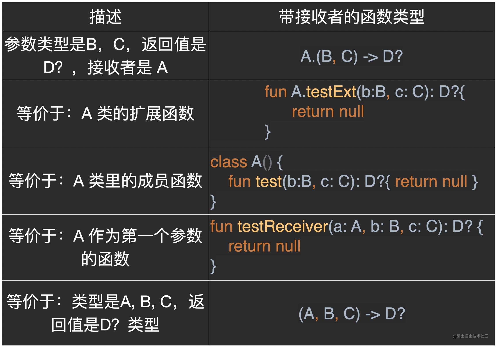

本文会系统的讲解 Kotlin 扩展函数和扩展属性以及比较难懂的扩展作用域和扩展静态解析，
最后再搭配一个实战环节，将扩展函数跟前面讲的高阶函数结合到一起。

扩展函数
扩展属性
顶层扩展
类内扩展
扩展的本质原理
扩展函数冲突
扩展函数的使用实例SharedPreferences Spannable
##---------------------------------------
1. 扩展是什么？
   Kotlin 的扩展，用起来就像是：能给一个类新增功能，这个新增的功能：可以是函数，也可以是属性。
   借助 Kotlin 扩展，我们能轻易的写出这样的代码：
   // 扩展函数
   "KotlinJetpackInAction".log()

   // 扩展属性
   val isBlank = String.isNullOrBlank

以上的代码，看起来就像是我们修改了原本 String 并且往里面加了方法和属性: log(), isNullOrBlank。
初次见到扩展这个特性的时候，我真的被惊艳到了。虽然扩展不是 Kotlin 独有的特性(别的现代语言也有)，但是，Kotlin 能在兼容 
Java 的同时引入这样的特性，那就真的很了不起了。

2. 顶层扩展 (Top Level Extension)
   顶层扩展，是最常用的扩展方式，它的定义方式也很简单，以上面的两行代码为例，我们看看它们分别应该怎么定义吧。
   // BaseExt.kt
   package com.boycoder.kotlinjetpackinaction

    // 注意！！
    // 顶层扩展不能定义在任何 Class 里，不然它就变成“类内扩展”了！

    // 为 String 定义扩展函数
    fun String.log() {
    println(this)
    }
    
    // 为 String 定义扩展属性
    val String?.isNullOrBlank: Boolean
    get() = this == null || this.isBlank()

3. 顶层扩展的原理是什么？
   要理解顶层扩展的实现原理，直接看字节码对应的 Java 即可，前面的文章已经讲过如何将 Kotlin 代码反编译成 Java，我们直
   
   接看结果：
   public static final void log(String $this$log) {
   System.out.println($this$log);
   }

    public static final boolean isNullOrBlank(String $this$isNullOrBlank) {
        return $this$isNullOrBlank == null || StringsKt.isBlank((CharSequence)$this$isNullOrBlank);
    }

顶层扩展的本质，其实就是 Java 的静态方法，这跟我们在 Java 中经常写的 Utils 类其实是一个原理。Kotlin 的顶层扩展用着感
觉很神奇，但它的原理异常简单。这一切都是因为 Kotlin 编译器帮我们做了一层封装和转换。
有的人可能会嗤之以鼻的说“这不就是语法糖嘛”，但我从中看到的是 Kotlin 这种追求简洁和生产力的设计思想。

//java
String aa = "123";
TestExtKt.log(aa);//Java语法中调用kt的扩展函数
boolean b = TestExtKt.isNullOrBlank(aa);

5. 类内扩展 (Declaring extensions as members)
   Package 级别的顶层扩展理解起来很简单，类内扩展会稍微复杂些。
   类内扩展(Declaring extensions as members) 在官方中文站的翻译是：扩展声明为成员，这个翻译虽然更接近本质，但太僵
   硬了，因此我在这里用 类内扩展 指代它。
   类内扩展的写法跟顶层扩展是一模一样的，区别在于它在其他类的里面。让我们来看一个例子：
   // 被扩展的类
   class Host(val hostname: String) {
   fun printHostname() { print(hostname) }
   }

class Test(val host: Host, val port: Int) {
fun printPort() { print(port) }

// 在 Test 类内给 Host 增加了一个扩展函数
//           ↓
fun Host.printConnectionString() {
printHostname()   // Host.printHostname()
print(":")
printPort()   // Test.printPort()
}

// 在 Test 类内给 Host 增加了一个扩展属性
//          ↓
val Host.isHomeEmpty: Boolean
get() = hostname.isEmpty()

     fun test() {
         host.printConnectionString()
     }
}

fun main() {
// 报错，Host 的类内扩展，在外面无法访问，这是与顶层扩展的不同
Host("").isHomeEmpty
Host("").printConnectionString()
}

5. 扩展小结：

顶层扩展 它不能定义在类内，它的作用域是 Package 级别的，能导包就能用
类内扩展 它定义在其他类内，它的作用与局限在该类内
类内扩展 的优势在于，它既能访问被扩展类(Host)，也能访问它所在的类(Test)
扩展 并没有实际修改被扩展的类，因此我们仍然只能访问类里的public方法和属性

6. 类内扩展的原理是什么？
   我们直接看反编译后的 Java：
   
   // Host 类并没有新增任何属性和方法
   //            ↓
   public final class Host {
   ...
   public final void printHostname() {
   String var1 = this.hostname;
   System.out.print(var1);
   }
   }

public final class Test {
public final void printPort() {
System.out.print(var1);
}
//      Host 的扩展函数，变成了 Test 的成员函数，Host 变成了参数
//                       ↓                  ↓
public final void printConnectionString(Host $this$printConnectionString) {
$this$printConnectionString.printHostname();
String var2 = ":";
System.out.print(var2);
this.printPort();
}
//      Host 的扩展属性，也变成了 Test 的成员函数，Host 变成了参数
//                           ↓       ↓
public final boolean isHomeEmpty(Host $this$isHomeEmpty) {
CharSequence var2 = (CharSequence)$this$isHomeEmpty.getHostname();
return var2.length() == 0;
}
}

我们回过头来看 类内扩展 的英文：(Declaring extensions as members)，这非常接近它的本质。看到这里，各位应该明白这两个
名字的差别：类内扩展描述的是表象；扩展声明为成员描述的是原理。
另外，在上面这个案例中，Test 叫做分发接收者(Dispatch Receiver)，Host 叫做扩展接受者(Extension Receiver)。这……是
不是好像在哪听过类似的名字？对！这里跟上一章节：高阶函数带接收者的函数类型相呼应了。

7. 扩展函数的类型是什么？
   上一章节讲带接收者的函数类型的时候，我讲过这样一句话：

从外表上看，带接收者的函数类型，就等价于成员函数(也等价于扩展函数)。但从本质上讲，它仍是通过编译器注入 this 来实现的。

一个表格来总结：

所以说，带接收者的函数类型和扩展函数的语法设计也是一样的。
下面是我在 Demo 里写的验证代码，感兴趣的小伙伴可以去 TestExt.kt 实际运行一下：
fun testFunctionType() {
var lambda: A.(B, C) -> D? = A::test
lambda = A::testExt
lambda = ::testReceiver
var lambdaX: (A, B, C) -> D? = lambda
}

:: 双冒号 即双对方法的引用。

8. 扩展是静态的
   扩展是静态的。
   这句话的潜台词是：扩展不支持多态。看这个代码案例很容易就能理解：
   open class Shape

class Rectangle: Shape()

fun Shape.getName() = "Shape"

fun Rectangle.getName() = "Rectangle"

fun printClassName(s: Shape) {
println(s.getName())
}

printClassName(Rectangle())
// 输出： Shape

这个特性虽然反直觉，但是很容易理解，以后我们使用过程当中注意一下就好。

9. 类内扩展 override，扩展函数冲突
   这部分是扩展函数相对难理解的部分，文字不容易解释，只有实际运行代码通过反编译才能弄清楚，请到 Demo 工程中找到 
   TestExtAsMember.kt 运行代码，然后反编译思考一下。相关解释我已经写到注释里了。代码案例也是直接用的官方文档里的，这个例子设计的很巧妙。
    
    TestExtAsMember.kt 的代码如下：
    
     open class Base { }

     class Derived : Base() { }
    
     open class BaseCaller {
     open fun Base.printFunctionInfo() {
     println("Base extension function in BaseCaller")
     }

     open fun Derived.printFunctionInfo() {
         println("Derived extension function in BaseCaller")
     }

     val Derived.test: Int
         get() = 1

     fun call(b: Base) {
         b.printFunctionInfo()   // 调用扩展函数
     }
}

class DerivedCaller: BaseCaller() {
override fun Base.printFunctionInfo() {
println("Base extension function in DerivedCaller")
}

    override fun Derived.printFunctionInfo() {
        println("Derived extension function in DerivedCaller")
    }
}

/**
* 步骤：先运行代码，然后调试代码，最后反编译代码。
*
* 理解这个例子的关键在于：
*
* BaseCaller().call(), DerivedCaller().call() 是多态的。
*
* 而 call 函数里的 base.printFunctionInfo() 是静态的。
*
* 这段话一定要结合反编译后的代码看
*
*/
fun main() {
BaseCaller().call(Base())
BaseCaller().call(Derived())
DerivedCaller().call(Base())
DerivedCaller().call(Derived())
}

以上代码的具体细节可以看我这个 GitHub Commit。

6. 实战
   学了这么多理论，终于到我们的实战环节了。

7. 扩展函数 + SharedPreferences
   还记得 Java 的 SharedPreferences 有多麻烦吗？这种模版代码我们是否写过很多？
   SharedPreferences sharedPreferences= getSharedPreferences("data",Context.MODE_PRIVATE);
   SharedPreferences.Editor editor = sharedPreferences.edit();
   editor.putString(SP_KEY_RESPONSE, response);

editor.commit();
editor.apply();

Java 时代我们可以封装类似 PreferencesUtils 来避免模版代码。而 Kotlin 的扩展函数能让我们的代码看起来更加的简洁。接下
来，我们为 SharedPreferences 增加一个扩展函数：
fun SharedPreferences.edit(
commit: Boolean = false,
action: SharedPreferences.Editor.() -> Unit
) {
val editor = edit()
action(editor)
if (commit) {
editor.commit()
} else {
editor.apply()
}
}

这个扩展函数很简单，我们直接看怎么用它吧。
// MainActivity.kt
private val preference: SharedPreferences by lazy(LazyThreadSafetyMode.NONE) {
getSharedPreferences(SP_NAME, MODE_PRIVATE)
}

private fun display(response: String?) {
...
preference.edit { putString(SP_KEY_RESPONSE, response) }
}

是不是清爽很多？我们终于有地方缓存 API 请求了。😂

注：另外，我们还可以结合 Kotlin 的其他特性将 SharedPreferences 封装的更加彻底，这个我们下一篇文章会讲哈。

9. 扩展函数 + Spannable
   Java 里要写一个复杂的 SpannableString，是件很痛苦的事情，我随手搜一段老代码，不知能否唤起你的痛苦记忆：
   SpannableString spannableString = new SpannableString("设置各种不同的字体风格：叶应是叶");
   TextView tv_styleSpan = (TextView) findViewById(R.id.tv_styleSpan);

StyleSpan bold = new StyleSpan(Typeface.BOLD);
StyleSpan italic = new StyleSpan(Typeface.ITALIC);
StyleSpan boldItalic = new StyleSpan(Typeface.BOLD_ITALIC);

spannableString.setSpan(bold, 12, 13, Spanned.SPAN_INCLUSIVE_EXCLUSIVE);
spannableString.setSpan(italic, 13, 14, Spanned.SPAN_INCLUSIVE_EXCLUSIVE);
spannableString.setSpan(boldItalic, 14, 16, Spanned.SPAN_INCLUSIVE_EXCLUSIVE);

tv_styleSpan.setText(spannableString);

让我们看看借助 Kotlin 的扩展函数能做出什么样的事情吧：
这是我们接下来要实现的效果，虽然它看着是4行文字，但它却是在一个 TextView 里展示的：

在 Java 里要实现这样一个效果得费不少力气，但借助 Kotlin 扩展函数，我们写一个这样的效果简直是不费吹灰之力：
// MainActivity.kt
username.text = ktxSpan {
name!!.bold().italic().size(1.3F).background(Color.YELLOW)
.append("\n")
.append("\n")
.append("Google".strike().italic().size(0.8F).color(Color.GRAY))
.append("\n")
.append(company!!.color(Color.BLUE).underline())
.append("\n")
.append("\n")
.append(url(blog!!, blog))
}

对应的 Kotlin 扩展函数是怎么实现的？其实也不难，前后不过 20 行代码：
这是入口函数，它接收一个初始值，还有一个 Lambda 表达式。注释写的很详细，我就不多解释了：
/**
* 顶层函数，作为 Span DSL 的入口类
*
* 这里用到一个重要知识点：CharSequence.() -> SpannableString 与 (CharSequence) -> SpannableString 等价
  */
  fun ktxSpan(s: CharSequence = SpannableString(""), func: CharSequence.() -> SpannableString) = func(s)

这是整个 ktxSpan 的核心代码：
/**
* 核心代码 setSpan(o, 0, length, Spannable.SPAN_EXCLUSIVE_EXCLUSIVE)
  */
  private fun span(s: CharSequence, o: Any): SpannableString = when (s) {
  is SpannableString -> s
  else -> SpannableString(s)
  }.apply { setSpan(o, 0, length, Spannable.SPAN_EXCLUSIVE_EXCLUSIVE) }

这里用扩展函数封装了各种 Span 的 Api：
/**
* 借助扩展函数，实现方便的 Api
  */
  fun CharSequence.bold(s: CharSequence = this) = span(s, StyleSpan(android.graphics.Typeface.BOLD))
  fun CharSequence.italic(s: CharSequence = this) = span(s, StyleSpan(android.graphics.Typeface.ITALIC))
  fun CharSequence.underline(s: CharSequence = this) = span(s, UnderlineSpan())
  fun CharSequence.strike(s: CharSequence = this) = span(s, StrikethroughSpan())
  /*部分代码省略*/
  

